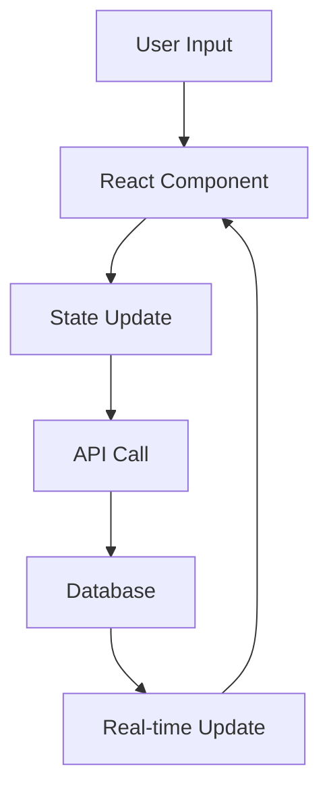

# Technical Documentation

## Architecture Overview

### Frontend Architecture

#### Component Structure
- `app/layout.tsx`: Root layout with Mantine provider and global styles
- `app/page.tsx`: Home page component
- `app/notes/`: Notes feature directory
  - `page.tsx`: Notes list with search and filtering
  - `new/page.tsx`: New note creation
  - `[id]/page.tsx`: Individual note view/edit

#### Components
- `components/layout/AppShell.tsx`: Main layout wrapper with navigation
- `components/note/NoteEditor.tsx`: Rich text editor with tag support

### State Management
- React hooks for local state
- URL-based routing for navigation
- Future implementation: Server state management with React Query

### Data Flow


## Database Schema

### Notes Table
```sql
CREATE TABLE notes (
  id UUID PRIMARY KEY DEFAULT uuid_generate_v4(),
  title TEXT NOT NULL,
  content TEXT NOT NULL,
  created_at TIMESTAMP WITH TIME ZONE DEFAULT NOW(),
  updated_at TIMESTAMP WITH TIME ZONE DEFAULT NOW(),
  user_id UUID REFERENCES auth.users(id)
);
```

### Tags Table
```sql
CREATE TABLE tags (
  id UUID PRIMARY KEY DEFAULT uuid_generate_v4(),
  name TEXT NOT NULL UNIQUE,
  created_at TIMESTAMP WITH TIME ZONE DEFAULT NOW()
);
```

### Note Tags Table
```sql
CREATE TABLE note_tags (
  note_id UUID REFERENCES notes(id) ON DELETE CASCADE,
  tag_id UUID REFERENCES tags(id) ON DELETE CASCADE,
  PRIMARY KEY (note_id, tag_id)
);
```

### Note References Table
```sql
CREATE TABLE note_references (
  source_note_id UUID REFERENCES notes(id) ON DELETE CASCADE,
  target_note_id UUID REFERENCES notes(id) ON DELETE CASCADE,
  created_at TIMESTAMP WITH TIME ZONE DEFAULT NOW(),
  PRIMARY KEY (source_note_id, target_note_id)
);
```

## API Routes

### Notes
- `GET /api/notes`: List all notes
- `POST /api/notes`: Create new note
- `GET /api/notes/:id`: Get note by ID
- `PUT /api/notes/:id`: Update note
- `DELETE /api/notes/:id`: Delete note

### Tags
- `GET /api/tags`: List all tags
- `GET /api/tags/:name/notes`: Get notes by tag
- `POST /api/notes/:id/tags`: Add tags to note
- `DELETE /api/notes/:id/tags`: Remove tags from note

### Search
- `GET /api/search`: Search notes and tags
- Parameters:
  - `q`: Search query
  - `tags`: Array of tag names to filter by
  - `limit`: Number of results to return
  - `offset`: Pagination offset

## Security

### Authentication
- Supabase Authentication
- JWT tokens for API requests
- Row Level Security (RLS) policies

### Data Protection
```sql
-- Example RLS Policy
CREATE POLICY "Users can only see their own notes"
ON notes
FOR SELECT
USING (auth.uid() = user_id);
```

## Performance Optimizations

### Frontend
- React.memo for expensive components
- Debounced search input
- Virtualized lists for large datasets
- Image optimization with Next.js Image
- Code splitting and lazy loading

### Backend
- Database indexing
- Caching strategy
- Connection pooling
- Query optimization

### Caching Strategy
```typescript
// Example cache configuration
export const revalidate = 3600; // Revalidate every hour

// Dynamic cache invalidation
export async function generateMetadata({ params }) {
  return {
    title: `Note ${params.id}`,
    revalidate: 60 // Revalidate this page every minute
  };
}
```

## Testing Strategy

### Unit Tests
- Component testing with React Testing Library
- Hook testing with @testing-library/react-hooks
- Utility function testing with Jest

### Integration Tests
- API route testing
- Database operations
- Authentication flow

### E2E Tests
- User flows with Cypress
- Critical path testing
- Performance monitoring

## Deployment

### Production Checklist
- [ ] Environment variables configured
- [ ] Database migrations applied
- [ ] Security headers set
- [ ] Error monitoring setup
- [ ] Analytics integration
- [ ] Backup strategy implemented
- [ ] SSL certificates configured
- [ ] CDN setup
- [ ] Rate limiting implemented
- [ ] API documentation generated

### Monitoring
- Error tracking with Sentry
- Performance monitoring with Vercel Analytics
- Database monitoring with Supabase Dashboard
- Custom logging implementation

## Development Guidelines

### Code Style
```typescript
// Example component structure
'use client';

import React from 'react';
import { useCallback, useState } from 'react';

interface Props {
  // Props interface
}

export function ComponentName({ prop1, prop2 }: Props) {
  // Component implementation
}
```

### Git Workflow
1. Feature branches from `main`
2. Pull request template
3. Code review checklist
4. Automated testing
5. Continuous integration

### Documentation
- TSDoc for components and functions
- Swagger/OpenAPI for API routes
- README updates for new features
- Changelog maintenance 